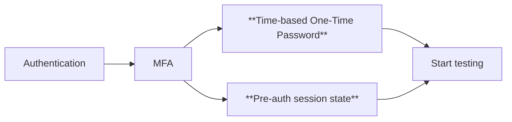

# 🛡️ AUTH 🛡️

<style>
  h1 {
    font-size: 10em !important;
  }
</style>

---

# Authenticated browser state

- Contains cookies, local storage, session storage
- Run `npx playwright codegen <url> --save-storage=<path>`

> More info: <https://www.eliostruyf.com/e2e-testing-mfa-environment-playwright-auth-session/>

<dt-show>
  <text-highlight highlight-color="var(--vscode-errorForeground)" direction="center-out" style="font-size: 1.5em; margin: 2em auto;">
    Don't commit the storage state file to version control!
  </text-highlight>
</dt-show>

---
layout: default
---

# Pre-authenticated sessions

Log in once. Every test reuses the session.

```typescript
// auth.setup.ts — runs once before the whole suite
setup("authenticate as submitter (Alex Chen)", async ({ page }) => {
  await page.goto("/");
  await page.locator(".user-tile[data-user='alex']").click();
  await expect(page.locator("#app-screen")).toBeVisible();
  // Write the auth logic here, e.g. fill in credentials, click login, etc.
  await page.context().storageState({ path: STORAGE_STATE_SUBMITTER });
});
```

```typescript
// playwright.config.ts — switch persona with one line
test.use({ storageState: STORAGE_STATE_APPROVER });
```

---

# In the real world


```ts
// 1. Go to the login page

// 2. Find and fill in the email input
const emailInput = page.locator("input[type=email]");
await emailInput.click();
await emailInput.fill(userName);
await page.locator("input[type=submit]").click();

// 3. Find and fill in the password input
const passwordInput = page.locator("input[type=password]");
await passwordInput.click();
await passwordInput.fill(password);
await page.locator("input[type=submit]").click();

// 4. Wait for the redirect to the some dashboard page
```

---

# In the real world



<br />

> Reference: [Using an authenticated session state](https://www.eliostruyf.com/e2e-testing-mfa-environment-playwright-auth-session/)
